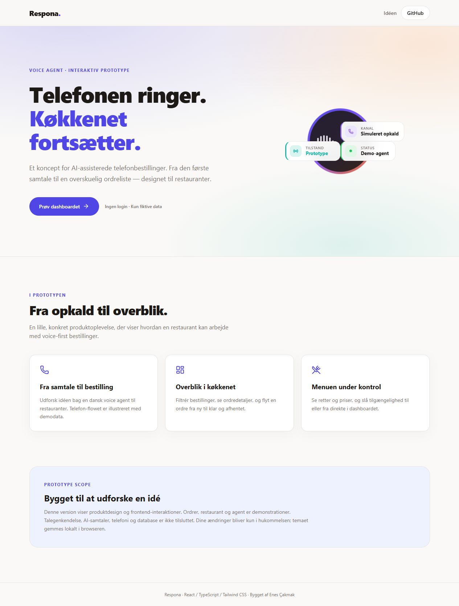
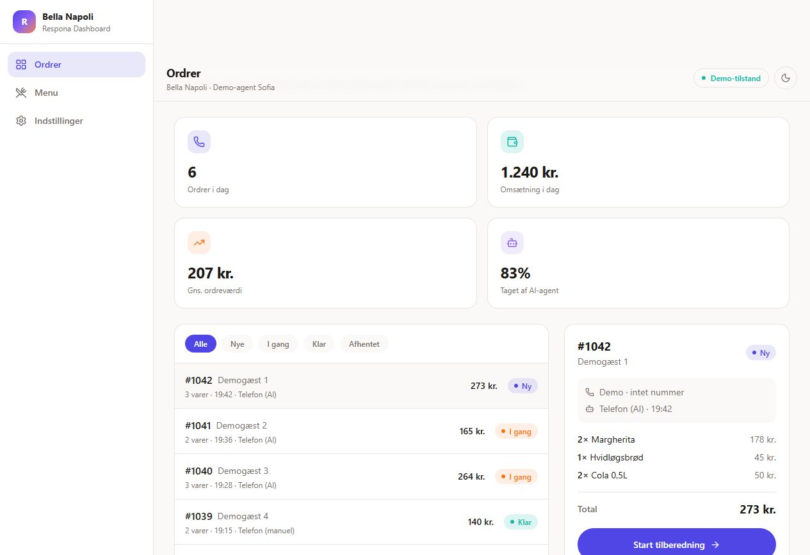

<div align="center">

# Respona - Voice Agent Prototype

### The phone rings. The kitchen keeps moving.

A Danish voice-agent concept for restaurants, brought to life as an interactive frontend prototype.


[Try the prototype](https://enesckmk1.github.io/respona-prototype/) · [Open the dashboard](https://enesckmk1.github.io/respona-prototype/#/dashboard)

</div>



## The idea

Restaurants need to serve guests while the phone keeps ringing. Respona explores how a Danish voice agent could capture phone orders and hand them to a clear, practical kitchen dashboard.

This repository showcases the product interface with synthetic data. It does not make phone calls, run AI models, collect contact submissions, or connect to a database.

## Explore the demo

- **Order dashboard** — inspect line items, totals and notes; filter by status; move orders from new to preparing, ready and collected.
- **Menu management** — browse categories and toggle item availability.
- **Restaurant settings** — view a sample restaurant profile, agent persona and opening hours.
- **Light and dark themes** — responsive layouts for desktop and mobile.



Changes to orders and menu availability reset on reload. Only the theme preference is saved in local storage. All customers and restaurant information are fictional; phone numbers are deliberately omitted.

## Run locally

Requires Node.js 22.12+ (Node.js 24 is used in CI).

```bash
npm ci
npm run dev
```

Open the address printed by Vite, then select **Prøv dashboardet**. No account, API key or environment file is needed.

```bash
npm run check   # TypeScript
npm run build   # Typecheck and production bundle
npm run preview # Serve the production bundle locally
```

## Implementation

| Area       | Choice                                  |
| ---------- | --------------------------------------- |
| Interface  | React 19 and TypeScript                 |
| Styling    | Tailwind CSS 4 and Lucide icons         |
| Build      | Vite 8                                  |
| State      | React state with deterministic fixtures |
| Navigation | Hash routes for static hosting          |
| Hosting    | GitHub Pages via GitHub Actions         |

The public source contains only the prototype: reusable dashboard components, demo fixtures, visual assets and static build configuration. It is an independent snapshot without backend code, database schemas, production configuration or private development history.

## Scope

Voice recognition, language-model reasoning, speech synthesis, telephony, authentication and persistent storage are outside this frontend demo. Agent indicators illustrate the concept and do not report a connected service.

## License

MIT — see [LICENSE](LICENSE).
